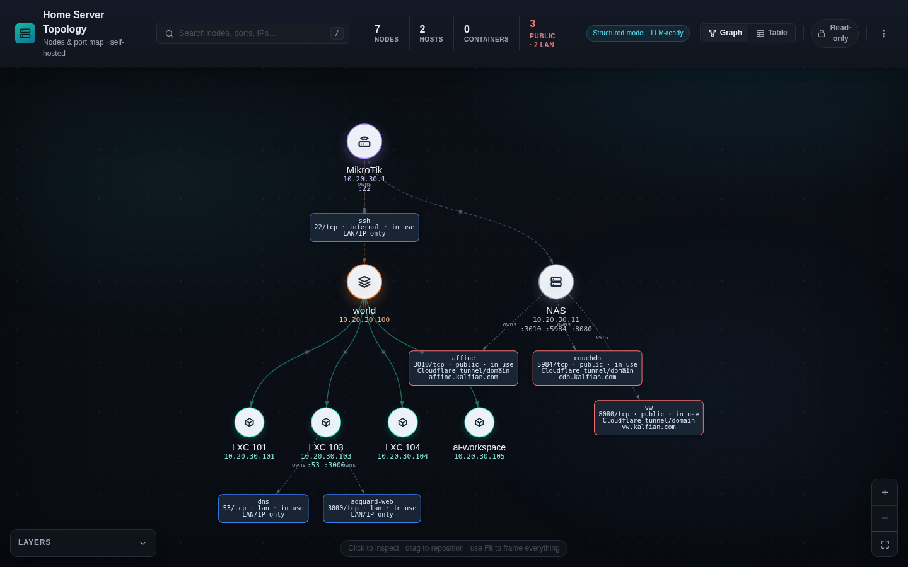
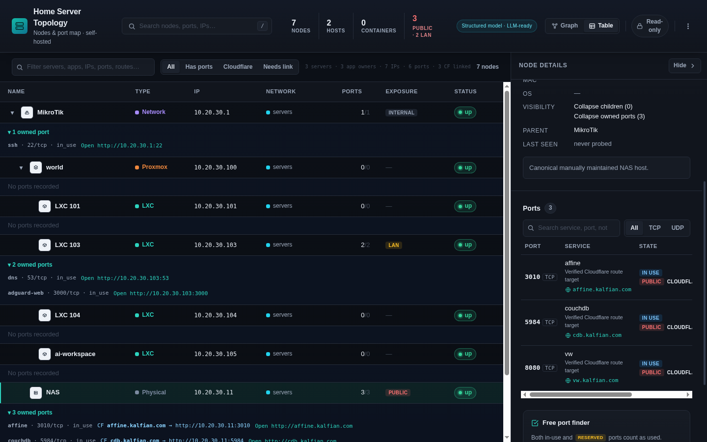
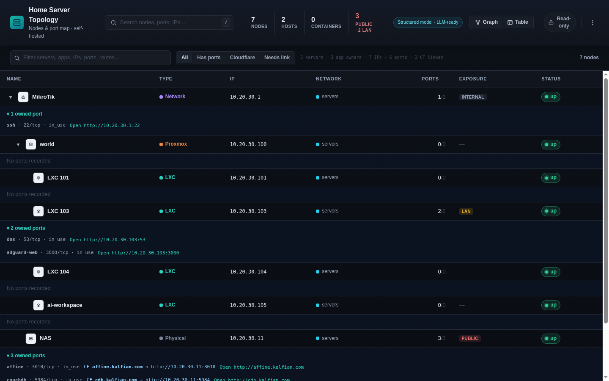

# Portico — Home Server Topology & Port Manager

Self-hosted tool to map a home-server topology as a **multi-parent directed acyclic graph
(DAG)** and track every service port as a first-class graph entity. Use it to document
physical hosts, VMs, containers, network devices, dependencies, and the exact URL behind
each port.



- 🗺️ Multi-level, many-to-many topology graph with cycle prevention
- 🔌 Ports rendered as distinct graph cards, with a reliable external **Go to** URL
- ↔️ Drag nodes and ports freely; positions persist only while editing
- 📋 Collapsible table hierarchy for parent/child nodes and their ports
- 🌐 Networks / VLANs, exposure levels (`internal` / `lan` / `public`), duplicate-IP/MAC/port conflict detection
- 🩺 Active **health check** (TCP/HTTP probe → live status + "last seen")
- 📥 **Import** from `docker ps`, `ss`, Proxmox `qm/pct list`, or `nmap` (parse → preview → apply)
- 🤖 **LLM-friendly**: REST, OpenAPI, one-call context, scoped tokens, and MCP tools
- 🔒 Single-password gate (read-only until you log in) · runs great in Docker

Stack: Node + Express + SQLite (better-sqlite3), vanilla vis-network frontend. No cloud, no telemetry, works air-gapped.

| Node inspector & per-node port map | Sortable table view |
|:---:|:---:|
|  |  |

---

## Quick start

### Option A — Prebuilt image (fastest)

```bash
docker run -d --name portico -p 3000:3000 -v portico_data:/app/data \
  ghcr.io/kalfian/portico:latest
```

Open **http://localhost:3000** → you'll be asked to **create a password** on first load,
then log in to edit. Data (SQLite DB + cached icons) persists in the `portico_data` volume.

> The image is published to GitHub Container Registry (multi-arch: amd64 + arm64).
> If the package is private, run `docker login ghcr.io` first (PAT with `read:packages`),
> or make it public under the repo's *Packages → portico → Package settings*.

### Option B — Docker Compose (build from source)

```bash
git clone https://github.com/kalfian/portico.git && cd portico
docker compose up -d --build
# → http://localhost:3000
```

### Option C — Local (Node ≥ 20)

```bash
git clone https://github.com/kalfian/portico.git && cd portico
npm install
npm test           # run the Node test suite
npm run dev        # start with auto-restart on change
# npm start        # start without file watching
# → http://localhost:3000
```

On first boot the DB is created at `data/topology.db` (WAL mode) and **seeded with a
sample topology**: Internet → Mikrotik Router → two devices, with two service ports shown
as graph cards under Device 2. Use **data menu → Reset sample data** to restore it.

---

## For LLMs / AI agents

Portico is built to be driven by an LLM or automation. An agent can **read the whole
homelab in one call** and **make changes with a scoped token**.

**Base URL:** wherever you run it, e.g. `http://homelab.local:3000`.

**1. Understand the topology** (no auth needed — reads are public):

```bash
curl http://localhost:3000/api/llm/context
# → { "summary": "<markdown: hosts→guests, IPs, ports+exposure, networks/VLANs, links>",
#     "data": { "nodes":[...], "ports":[...], "networks":[...], "links":[...] } }
```

`GET /api/llm/context` is the single best entry point — the `summary` is human/LLM-readable
prose, `data` is the full structured state.

**2. Discover the full API** (for tool-calling / function-calling):

```bash
curl http://localhost:3000/api/openapi.json     # complete OpenAPI 3 spec, both auth schemes
```

**3. Make changes** — create a token, then send it as a Bearer header:

- In the UI (logged in): **data menu → API tokens → create** (pick a scope), copy the
  token shown **once**. Or create one over the API from a logged-in session (see [Auth](#auth)).
- **Scopes:** `read` = GET only (safe for observe-only agents); `read_write` = full CRUD.

```bash
TOKEN=hst_xxxxxxxx...
# read anything
curl -H "Authorization: Bearer $TOKEN" http://localhost:3000/api/topology
# create a node (needs read_write)
curl -H "Authorization: Bearer $TOKEN" -H 'Content-Type: application/json' \
  -X POST http://localhost:3000/api/nodes \
  -d '{"name":"new-vm","type":"vm","ipAddress":"10.20.30.40","parentIds":["n-device-2"]}'
```

**Errors** are always `{ "error": { "code": "...", "message": "..." } }` with a matching
HTTP status — e.g. `port_conflict` (409), `cycle_detected` (400), `forbidden_scope` (403).
JSON is camelCase everywhere.

> Tip for agents: `GET /api/llm/context` to orient, `GET /api/openapi.json` to learn the
> exact request shapes, then act with a `read_write` token. Reads never need a token.

### MCP

Portico exposes a stateless JSON-RPC MCP endpoint at `POST /mcp`. Create an API token in
**data menu → API tokens**, then configure an HTTP-capable MCP client with:

```json
{
  "mcpServers": {
    "portico": {
      "url": "http://localhost:3000/mcp",
      "headers": {
        "Authorization": "Bearer ${PORTICO_TOKEN}"
      }
    }
  }
}
```

Client configuration formats vary. The required transport contract is HTTP `POST`, JSON
content, and `Authorization: Bearer $PORTICO_TOKEN` on authenticated requests. Portico
advertises MCP protocol version `2025-03-26`; `initialize` may be called without a token,
while tool discovery and calls require one.

| Tool | Minimum scope | Arguments |
|---|---|---|
| `topology_get` | `read` | `{}` |
| `node_create` | `read_write` | `{ "node": { ... } }` |
| `node_update` | `read_write` | `{ "id": "...", "node": { ... } }` |
| `node_delete` | `read_write` | `{ "id": "..." }` |
| `port_create` | `read_write` | `{ "nodeId": "...", "port": { ... } }` |
| `port_update` | `read_write` | `{ "id": "...", "port": { ... } }` |
| `port_delete` | `read_write` | `{ "id": "..." }` |

Initialize and inspect the available tools:

```bash
curl http://localhost:3000/mcp \
  -H 'Content-Type: application/json' \
  -d '{"jsonrpc":"2.0","id":1,"method":"initialize","params":{}}'

curl http://localhost:3000/mcp \
  -H 'Content-Type: application/json' \
  -H "Authorization: Bearer $PORTICO_TOKEN" \
  -d '{"jsonrpc":"2.0","id":2,"method":"tools/list","params":{}}'
```

Read the topology or create a port card with an explicit external URL:

```bash
curl http://localhost:3000/mcp \
  -H 'Content-Type: application/json' \
  -H "Authorization: Bearer $PORTICO_TOKEN" \
  -d '{"jsonrpc":"2.0","id":3,"method":"tools/call","params":{"name":"topology_get","arguments":{}}}'

curl http://localhost:3000/mcp \
  -H 'Content-Type: application/json' \
  -H "Authorization: Bearer $PORTICO_TOKEN" \
  -d '{"jsonrpc":"2.0","id":4,"method":"tools/call","params":{"name":"port_create","arguments":{"nodeId":"n-device-2","port":{"portNumber":3000,"protocol":"tcp","serviceName":"Dashboard","scheme":"http","exposure":"lan","status":"in_use","externalUrl":"http://10.20.30.3:3000"}}}}'
```

Tool results include both MCP text content and `structuredContent`. A `read` token may list
tools and call `topology_get`; mutation attempts return JSON-RPC error `-32003`. Use the REST
API and `GET /api/openapi.json` for networks, typed links, import, probes, and token management.

---

## Configuration

| Env var | Default | Purpose |
|---|---|---|
| `PORT` | `3000` | HTTP listen port |
| `DB_PATH` | `data/topology.db` | SQLite file path (mounted as a volume in Docker) |
| `SESSION_SECRET` | `change-me-home-topology` | Signs the session cookie — **set a strong value in any real deployment** |
| `COOKIE_SECURE` | `false` | Set `true` when served over HTTPS / behind a reverse proxy |

With Compose, put these in a `.env` next to `docker-compose.yml`. Change the host port with
`PORT=8080 docker compose up -d` (maps host `8080` → container `3000`).

---

## Auth

Single-password gate + API bearer tokens.

- **Reads are public** — any `GET` works with no auth (view/observe freely).
- **Mutations require EITHER** a logged-in session **OR** a `read_write` bearer token.
- A `read` token authenticates but may only read (mutations → `403 forbidden_scope`).
- **Token management + change-password require an interactive session** (never a token).
- First run: `POST /api/auth/setup` creates the password (only if none set), then logs you in.

Password is hashed with node's built-in `crypto.scryptSync` (salt + timing-safe compare, no
native build deps). Session via `express-session` (in-memory; re-login after a restart is
expected for a single-user homelab). Tokens: `hst_` + 32 random bytes, stored as a `sha256`
hash + display prefix, plaintext shown **once**, `last_used_at` tracked, revocable.

```bash
# create a token from a logged-in session (cookies.txt holds the session cookie)
curl -b cookies.txt -X POST http://localhost:3000/api/tokens \
  -H 'Content-Type: application/json' -d '{"name":"my-llm","scope":"read_write"}'
curl -b cookies.txt http://localhost:3000/api/tokens                 # list
curl -b cookies.txt -X DELETE http://localhost:3000/api/tokens/<id>  # revoke
```

> This is app-level access control, sensible for a single-user LAN tool. For anything
> internet-facing, also put it behind a reverse proxy (e.g. Traefik + Authelia).

---

## API reference

**Reads (public):**
- `GET /api/nodes`, `GET /api/nodes/:id`
- `GET /api/nodes/:id/ports`, `GET /api/nodes/:id/free-ports?from=&to=&protocol=`
- `GET /api/networks`, `GET /api/networks/:id/free-ips?limit=`
- `GET /api/links`
- `GET /api/topology`, `GET /api/export`
- `GET /api/llm/context`, `GET /api/openapi.json`
- `GET /api/icons/:slug` (cached selfh.st proxy), `GET /api/icons` (index for autocomplete)
- `GET /api/auth/status`

**Mutations (session OR `read_write` token):**
- `POST /api/nodes`, `PUT /api/nodes/:id`, `DELETE /api/nodes/:id`
- `POST /api/nodes/:id/ports`, `PUT /api/ports/:id`, `DELETE /api/ports/:id`
- `POST /api/networks`, `PUT /api/networks/:id`, `DELETE /api/networks/:id`
- `POST /api/links`, `PUT /api/links/:id`, `DELETE /api/links/:id`
- `POST /api/import` (replace-all JSON, transactional)
- `POST /api/probe`, `POST /api/nodes/:id/probe` — [health check](#health-check)
- `POST /api/import/parse`, `POST /api/import/apply` — [import from real sources](#import-from-real-sources)

**Session-only (interactive):**
- `POST /api/auth/setup`, `POST /api/auth/login`, `POST /api/auth/logout`, `POST /api/auth/change-password`
- `GET /api/tokens`, `POST /api/tokens`, `DELETE /api/tokens/:id`

Error codes: `unauthorized` (401), `forbidden_scope` (403), `not_found` (404),
`validation_error` (400), `cycle_detected` (400), `port_conflict` (409), `conflict` (409),
`internal_error` (500).

### Health check

`POST /api/probe` (all, or `{ "nodeIds": [...] }`) and `POST /api/nodes/:id/probe`. A short
IPv4 **TCP connect** to `node.ipAddress:port` decides reachability (http/https ports refined
with a `HEAD /`); concurrency-capped with a hard time budget. It sets `node.status`
(`up`/`down`; `unknown` left untouched) and `last_seen` on the node + each reachable port —
it **never** overwrites a port's `in_use`/`reserved` status. UDP ports and address-less nodes
are reported as `skipped`. Caps: ≤200 nodes / ≤2000 ports, timeout 200–10000 ms (default 1500),
concurrency 1–20 (default 10), 60 s overall budget.

### Import from real sources

Two steps so you review before anything is written (both require auth):

- `POST /api/import/parse` — `{ source, text }`, `source` ∈ `docker_ps` | `ss` | `proxmox` |
  `nmap`. **Dry-run**, returns a preview `{ source, nodes, ports, warnings }`. Preview nodes
  carry a `ref`; preview ports link via `nodeRef` (except `ss` ports → `nodeRef:null`, you
  pick their node at apply time).
- `POST /api/import/apply` — the previewed (optionally edited) payload
  `{ nodes, ports, parentIds?, networkId?, nodeId? }`. Additive, one transaction, de-duped
  (nodes by name **or** IP, ports by `(node, port, protocol)`). Returns created vs skipped.

Supported inputs: `docker ps` (table **or** `--format '{{json .}}'`) → containers + published
port mappings; `ss -tlnp`/`-tulpn` → listening ports; Proxmox `qm list` + `pct list` → VMs/LXCs;
`nmap -oX -` XML → hosts + open ports.

```bash
curl -H "Authorization: Bearer $TOKEN" -H 'Content-Type: application/json' \
  -X POST http://localhost:3000/api/import/parse \
  -d '{"source":"docker_ps","text":"0.0.0.0:8080->80/tcp   my-web"}'
```

---

## Deployment notes (Docker)

Multi-stage `Dockerfile` — build stage compiles `better-sqlite3`; slim runtime runs as
non-root `node` with a `HEALTHCHECK`. The SQLite DB + cached selfh.st icons live in the
`portico_data` volume (`/app/data`) and survive restarts/rebuilds. Prefer a host path? swap
the volume line in `docker-compose.yml` for `- ./data:/app/data`.

**Publishing:** `.github/workflows/docker-publish.yml` builds and pushes `ghcr.io/kalfian/portico`
(amd64 + arm64) on every push to `main` and on `v*` tags. Tags: `latest` (main), `sha-<short>`
per commit, and `X.Y.Z` / `X.Y` when you push a `vX.Y.Z` tag (`git tag v1.0.0 && git push origin v1.0.0`).

---

## How it's built

- **Frontend** (`public/`) — vanilla JS + vendored vis-network (no CDN), loads state from
  `GET /api/topology`, sends every change through the API, gates editing on the server session.
  Graph cards represent both nodes and ports. Edit-mode drag saves positions; read-only drag is
  temporary and resets on reload. The table view collapses nodes, children, and ports.
- **Backend** (`server/`) — Express + better-sqlite3, hand-written SQL migrations in
  `server/migrations/` applied on boot inside a transaction (tracked via `PRAGMA user_version`;
  `WAL` + `foreign_keys` on). `node_parents` stores many-to-many containment edges; `ports`
  belong to one node and store `external_url`, `pos_x`, and `pos_y`. Other entities include
  `networks`, typed `links`, `tags`+`node_tags`, `auth`, and `api_tokens`. Server-side guards
  enforce DAG cycles, unique `(node, port, protocol)` values, URLs, IPv4 values, and enums.
- **Automation** — REST routes under `/api`, OpenAPI at `/api/openapi.json`, compact LLM
  context at `/api/llm/context`, and MCP JSON-RPC tools at `/mcp` share the same store rules.
- **Seed** (`server/seed.js`) — runs only when the DB is empty and creates the documented
  Internet → router → devices example, including two port cards attached to Device 2.

`prototype/index.html` is the original standalone (localStorage-only) prototype, kept for reference.
